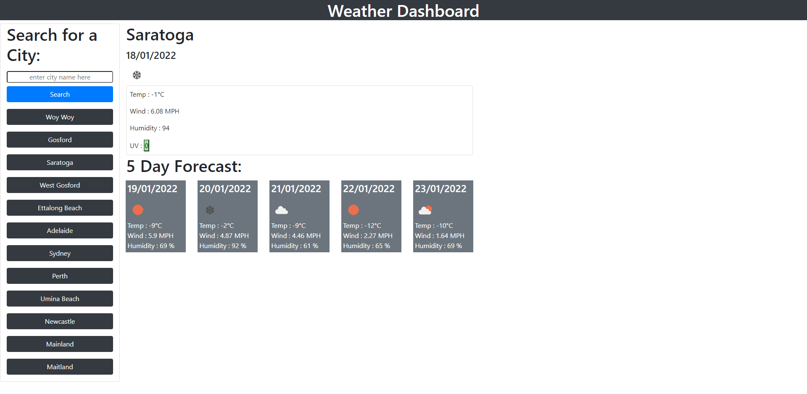

# Weather Dashboard
## Description

Task: To create a Weather Dashboard using the OpenWeather One Call API.  The use will input a city name and the page will render the weather conditiions for the current day and also for the next 5 days. Each city will be saved as a button and show on the page even after reload.  It's intended use is for travellers who need to see the weather outlook for multiple cities, so that I plan their travels accordingly.

#
## What I learned
During the completion of this task, I learned:
- How to call a third party api and set parameters
- How to include parameters within the function, before calling fetch
- How to carry data forward from one fetch function, into a second fetch function
- How to clear the page of the previous search results, before displaying the new search results
- How to restrict duplicated button generation when search and city buttons selected
- A clearer understanding of localStorage set & get
- How back-ticks are used
- That Bootstrap is great, but I definitely need some practice!
- When working with multiple cards, just have the container in html and dynamically create elements in js
- A little bit of emmet

#
## Steps Taken

- #### Step 1 - Create html, css, js and  README files

- #### Step 2 - HTML format 

- #### Step 3 - JS - sections 1 and 2 (left & right)

- #### Step 4 - JS - added event listeners for 2 types of buttons

- #### Step 5 - JS - created fetch function using data from input (check for validity)

- #### Step 6 - JS - created fetch fuction to create new buttons and display weather data

- #### Step 7 - JS - upated for date and number conversions

- #### Step 8 - JS - created function to create icons

- #### Step 9 - JS - created button to display color-coded UV index

- ### Step 10 - HTML -Bootstrap styling/re-styling (needed more time)

#
[Click here to view Weather Dashboard Website](https://github.com/michelledwoods1/Weather_Dashboard/)
#
